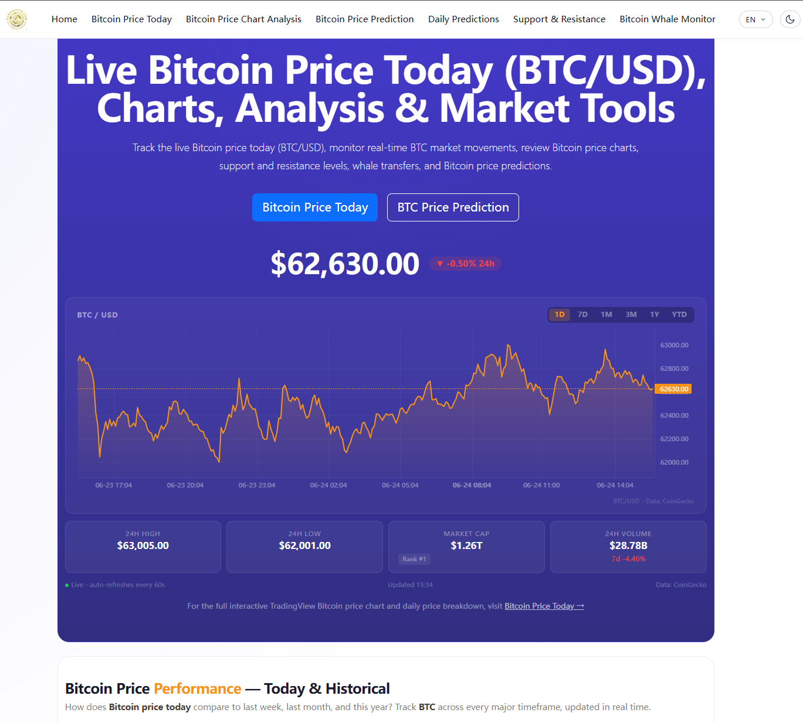
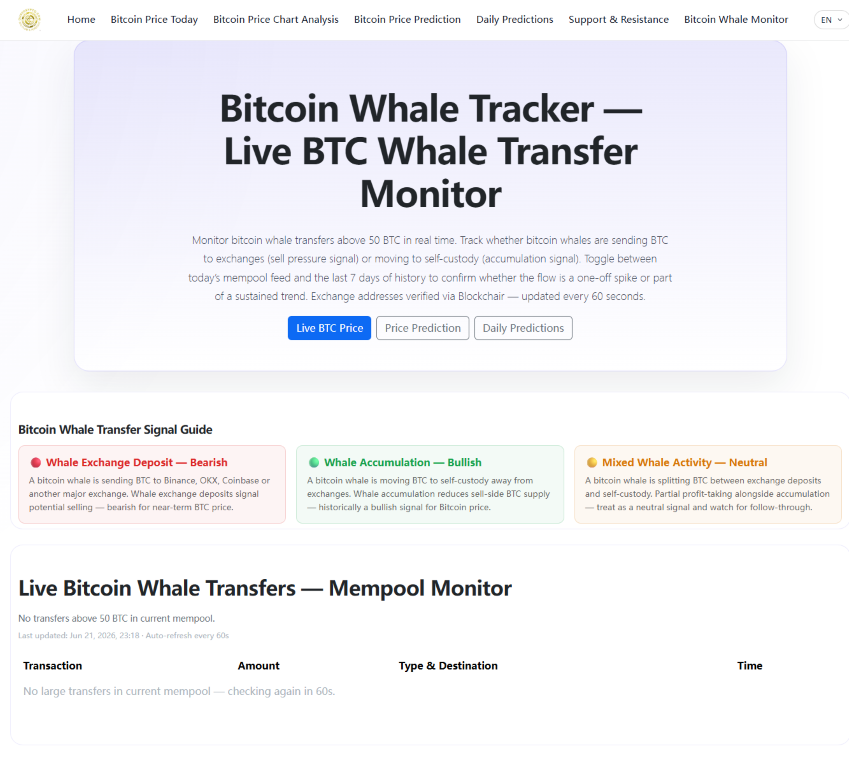
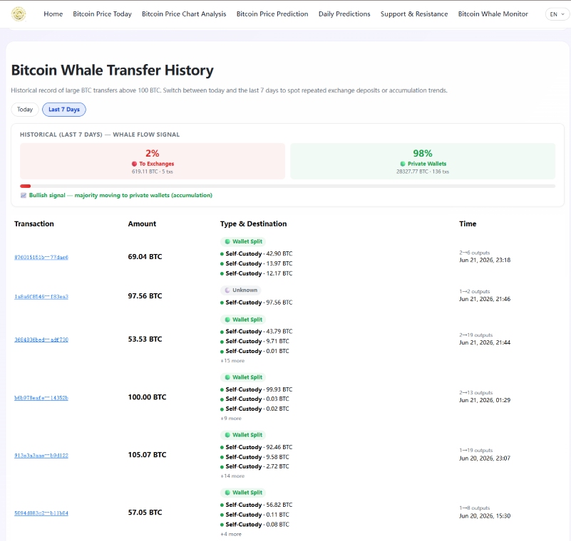

  

# 🐋 OursCrypto — Free Bitcoin Whale Tracker & BTC Market Dashboard

> Real-time Bitcoin whale monitoring, price prediction, and on-chain market analysis.  
> ⭐ Star this repo if you find it useful!

## 🚀 Live Platform

👉 **[https://ourscrypto.com](https://ourscrypto.com)**

---

## 🔍 What is OursCrypto?

OursCrypto is a free, real-time Bitcoin market dashboard and whale tracker. Built for traders, investors, and on-chain analysts who want to monitor large BTC transactions and market signals before the market reacts.

---

## ✨ Core Features

### 🐋 Bitcoin Whale Monitor
- Tracks large on-chain BTC transactions in real time
- Custom UTXO-deep cleansing algorithm filters out exchange internal "change addresses" and native transaction noise
- Logs only true whale movements, exchange inflows, and selling pressure

### 📊 Bitcoin Price Dashboard
- Live BTC price with multi-period performance stats
- Support & resistance levels based on active chain volume
- Candlestick analysis and market structure visualization

### 🔮 BTC Price Prediction
- AI-assisted Bitcoin price forecast
- Updated daily with on-chain data signals

### 🌐 Multilingual Support
- English & Chinese (zh-CN)

---

## 🛠 Tech Stack

| Layer | Technology |
|-------|------------|
| Frontend | Next.js 15+ (App Router, Edge SSR) |
| Deployment | Vercel (Global Edge Network, 301 SEO redirects) |
| Database | Supabase (PostgreSQL, millisecond-level block-data logging) |
| Styling | Bootstrap 5 |
| Security | Cloudflare |
| Analytics | Google Analytics |

> Note: The core algorithmic processing engine remains private to protect database credentials and prevent unauthorized API access.

---

## 🗺 Pages

| Page | URL |
|------|-----|
| Home Dashboard | https://ourscrypto.com |
| Whale Tracker | https://ourscrypto.com/bitcoin/whale-transfers |
| Price Charts | https://ourscrypto.com/bitcoin/price-charts |
| BTC Prediction | https://ourscrypto.com/bitcoin/btc-price-prediction |
| Support & Resistance | https://ourscrypto.com/bitcoin/bitcoin-support-and-resistance-levels |

---

## 📸 Screenshots

## 📸 Screenshots

### 🏠 Home Dashboard

### 🐋 Whale Monitor — Live Feed

### 📊 Whale Transfer History

---

## 🔍 Security & Trust Verifications

| Authority | Status |
|-----------|--------|
| Google PageSpeed Insights | ✅ Core Web Vitals Verified |
| DNSLytics Network Audit | ✅ Secure DNS & Edge Routing |
| ScamAdviser Trust Index | ✅ Verified Fair & Safe |

---

## 📈 Reference & Attribution

If you are an on-chain researcher, trader, or content creator and find our UTXO deduplication methodology useful, feel free to reference our metrics or link back to our dashboard.

- 🐋 Live Whale Tracker: [ourscrypto.com/bitcoin/whale-transfers](https://ourscrypto.com/bitcoin/whale-transfers)
- 📊 BTC Support/Resistance: [ourscrypto.com/bitcoin/bitcoin-support-and-resistance-levels](https://ourscrypto.com/bitcoin/bitcoin-support-and-resistance-levels)
- 🔮 BTC Price Prediction: [ourscrypto.com/bitcoin/btc-price-prediction](https://ourscrypto.com/bitcoin/btc-price-prediction)

---

## 📬 Contact & Links

- 🌐 Website: [ourscrypto.com](https://ourscrypto.com)
- 🐦 Twitter/X: @jzcjimmy
  

---

## 📄 License

MIT License — free to use and reference.

---

*Built with ❤️ by an independent developer passionate about Bitcoin on-chain data.*
